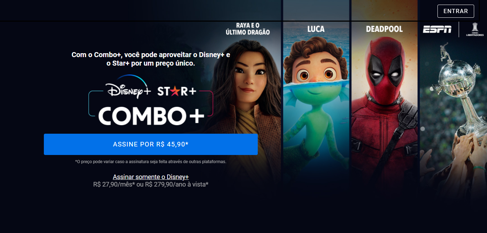

# Clone Disney+




## 🚀 Tecnologias
Esse projeto foi desenvolvido com as seguintes tecnologias:
### Front-end

- [React](https://reactjs.org/)
- [Styled-components](https://styled-components.com/)
- [TypeScript](https://www.typescriptlang.org/)
- [axios](https://axios-http.com/)
- [react-icons](https://react-icons.github.io/react-icons/)
- [slick-carousel](https://react-slick.neostack.com/)

### Back-end

- [express](https://expressjs.com/)
- [mongoDb](https://mongodb.com/)


## 🧪 Como executar
Clone o projeto e acesse a pasta do mesmo.


```bash
git clone https://github.com/Aldovani/clone-disneyplus

cd clone-disneyplus

```
Para iniciá-lo, siga os passos abaixo:

```bash
# Entra na pasta do front-end
cd .\frontend\

# Instalar as dependências com yarn
yarn

# Iniciar o projeto
yarn start

```
Abra outro terminal para o backend
```bash
# Entra na pasta do front-end
cd .\backend\

# Instalar as dependências com yarn
yarn

# Iniciar o projeto
yarn start

```